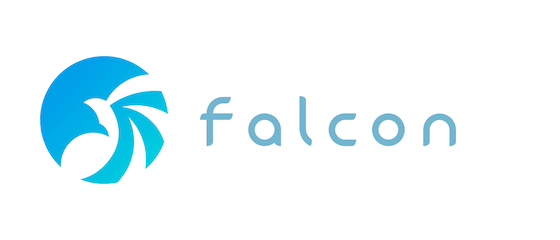

# Open-Falcon Backend



[](https://travis-ci.org/Cepave/open-falcon-backend)
[](https://codecov.io/gh/Cepave/open-falcon-backend)
[](https://godoc.org/github.com/Cepave/open-falcon-backend)
[](https://gitter.im/goappmonitor/Lobby?utm_source=badge&utm_medium=badge&utm_campaign=pr-badge&utm_content=badge)
[](https://landscape.io/github/Cepave/open-falcon-backend/master)
[](https://www.quantifiedcode.com/app/project/df24b20e9c504ad0a2ac9fa3e99936f5)
[](https://goreportcard.com/report/github.com/Cepave/open-falcon-backend)
[](http://www.apache.org/licenses/LICENSE-2.0.html)

# Documentations

- http://book.open-falcon.org
- http://docs.openfalcon.apiary.io

# Get Started

## Start MySQL and Redis using docker

    cd docker
    docker-compose -f init.yml up -d
    docker inspect docker_mysql_1
    docker inspect docker_redis_1
    cd ..

## Change your environment setting

    vi config/confgen.sh

## Start Backend modules

    make clean all pack
    mkdir out
    mv open-falcon-v2.0.0.tar.gz out/
    cd out
    tar zxvf open-falcon-v2.0.0.tar.gz
    ./open-falcon start agent graph transfer hbs fe query

# Building from source

## Binary
```bash
# all modules
make all

# specified module
make agent
```

## Docker image

Use [docker build](https://docs.docker.com/engine/reference/commandline/build/) at project root, for example:
```sh
docker build -t <image_name>:<image_tag> -f docker/alpine/Dockerfile .
```

# Run Open-Falcon Commands

Agent for example:

    ./open-falcon agent [build|pack|start|stop|restart|status|tail]

# Package Management

We use govendor to manage the golang packages. Please install `govendor` before compilation.

    go get -u github.com/kardianos/govendor

Most depended packages are saved under `./vendor` dir. If you want to add or update a package, just run `govendor fetch xxxx@commitID` or `govendor fetch xxxx@v1.x.x`, then you will find the package have been placed in `./vendor` correctly.

Make sure you're using Go 1.5+ and **GO15VENDOREXPERIMENT=1** env var is exported. (`export GODEBUG=cgocheck=0` using Go 1.6+.)

# Package Release

	make clean all pack

# Upgrading of MySql databases

See [scripts/mysql/README.md](scripts/mysql/README.md)

# Testing

There are environment variables could be used to set-up properties for testing:

* `$OWL_TEST_PROPS_FILE` - File name of properties
* `$OWL_TEST_PROPS` - Property content as single string
* `$OWL_TEST_PROPS_SEP` - Seperator to split record of property content in `$OWL_TEST_PROPS`

For example, you could use `make go-test` by:

```sh
OWL_TEST_PROPS="mysql.owl_portal=root:cepave@tcp(192.168.20.50:3306)/falcon_portal_test?parseTime=True&loc=Local" make go-test GO_TEST_VERBOSE=yes GO_TEST_FOLDER="modules/mysqlapi/rdb/owl"
```

Or use `go test`:
```sh
OWL_TEST_PROPS="mysql.owl_portal=root:cepave@tcp(192.168.20.50:3306)/falcon_portal_test?parseTime=True&loc=Local" go test ./modules/mysqlapi/rdb/owl -test.v
```

## GOMAXPROCS(-parallel)

Since some tests(e.x. database unit test) are stateful, these tests should be run in **single thread**:

1. `GOMAXPROCS=<n>` - By environment variable
1. `-parallel <n>` - By test flags

See `go help testflag` for detail information.

Example:

```sh
OWL_TEST_PROPS="mysql.owl_portal=root:cepave@tcp(192.168.20.50:3306)/falcon_portal_test?parseTime=True&loc=Local mysql.graph=root:cepave@tcp(192.168.20.50:3306)/graph?parseTime=True&loc=Local"

# By $GOMAXPROCS
GOMAXPROCS=1 go test ./modules/mysqlapi/...

# By -parallel
go test -parallel 1 ./modules/mysqlapi/...
```

## By using `make go-test`

Variables:
* `GO_TEST_FOLDER` - The inclusions of folders(recursively probed) to be tested
* `GO_TEST_EXCLUDE` - The exclusions of folders(include children), which are descendants of `GO_TEST_FOLDER`
* `GO_TEST_PROPS_FILE` - If the value is viable, the execution of "go test" would have additional arguments `-owl.test.propfile=<GO_TEST_PROPS_FILE>`
* `GO_TEST_PROPS` - If the value is viable, the execution of "go test" would have additional arguments `-owl.test=<GO_TEST_PROPS>`
* `GO_TEST_PROPS_SEP` - If the value is viable, the execution of "go test" would have additional arguments `-owl.test.sep=<GO_TEST_PROPS_SEP>`
* `GO_TEST_FLAGS` - If the value is viable, the execution of "go test" would have additional flags `<flags...>`
* `GO_TEST_VERBOSE` - If the value is "yes", the execution of "go test -test.v"(with additional flags of 3-party frameworks) would be applied
* `GO_TEST_COVERAGE_FILE` - If the value is viable, the execution of "go test" would be added with `-coverprofile <file>`

```sh
# Default execution
make go-test GO_TEST_FOLDER="modules common" GO_TEST_EXCLUDE="modules/fe modules/f2e-api"

# With MySql property and verbose output
make go-test GO_TEST_FOLDER="modules common" GO_TEST_EXCLUDE="modules/fe modules/f2e-api" GO_TEST_VERBOSE=yes GO_TEST_PROPS="mysql.owl_portal=root:cepave@tcp(192.168.20.50:3306)/falcon_portal_test?parseTime=True&loc=Local"
```

See `Makefile` for default values of the two variables.

In fact, the __Makefile__ uses __`go-test-all.sh`__ to perform `go-test`.

## By using `go-test-all.sh`

This script would try to detect the importing of "common/testing/<lib>" in __*\_test.go__ files.

If the configuration is matched, this script would append `-owl.test.propfile`, `-owl.test`, or `-owl.test.sep` flags.

Arguments:
* `-t <folders>` - The inclusions of folders(recursively probed) to be tested
* `-e <folders>` - The exclusions of folders(include children), which are descendants of `GO_TEST_FOLDER`
* `-f <args>` - If the value is viable, the execution of "go test" would have additional arguments `-owl.test.propfile=<args>`
* `-p <args>` - If the value is viable, the execution of "go test" would have additional arguments `-owl.test=<args>`
* `-s <args>` - If the value is viable, the execution of "go test" would have additional arguments `-owl.test.sep=<args>`
* `-a <flags>` - If the value is viable, the execution of "go test" would have additional flags `<flags>`
* `-v` - If this flag is shown, the execution of `go test -test.v`(with additional flags of 3-party frameworks) would be applied
* `-c <file>` - If this flag is shown, the `-coverprofile <file> would be set`

```sh
# Default execution
./go-test-all.sh -t "modules common" -e "modules/fe modules/f2e-api"

# With MySql property and verbose output
./go-test-all.sh -t "modules common" -e "modules/fe modules/f2e-api" -v -p "mysql.owl_portal=root:cepave@tcp(192.168.20.50:3306)/falcon_portal_test?parseTime=True&loc=Local"
```

## Usage of property file

Example of property file("__sample.properties__"):
```ini
mysql.owl_portal=root:cepave@tcp(192.168.20.50:3307)/falcon_portal
client.http.host=127.0.0.1
client.http.port=6040
```

Execute by `go-test-all.sh`:
```sh
OWL_TEST_PROPS_FILE="$PWD/sample.properties" ./go-test-all.sh -t "modules/mysqlapi/restful"
```
