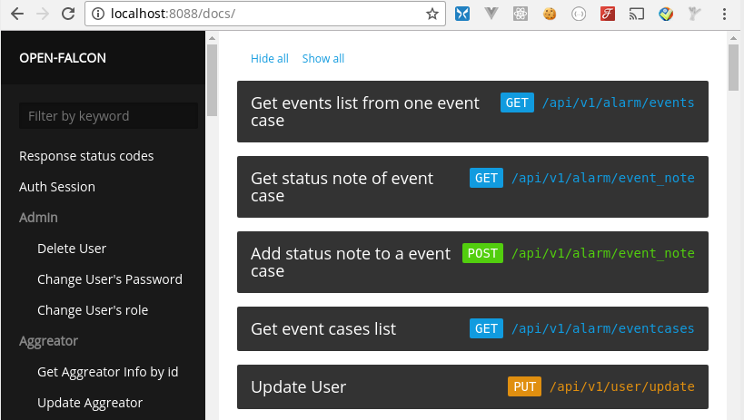

# OWL_Backend


[https://masato25.github.io/owl_backend/](https://masato25.github.io/owl_backend/)

[ web api backend made for open-falcon ]


开源版本 open-falcon 後台, 将以下模组的操作功能api化:
* Fe
  * 使用者,群组管理
* Portal
  * HostGroup, Host 管理
  * Template, 告警策略管理
* Graph
  * Host/Counter列表查询
* No-Data
  * NoData策略设置api
* Dashboard
  * 具备数据查询接口功能
* Screen

ps.
跨域问题實做可以參考 `sample_for_cross_api`


##  get markdown for docs web

```
git clone https://github.com/masato25/open-falcon-backend/ --branch docs --single-branch docs
```

rebuild docs
```
gem install jekyll
jekyll build
```
set up config
```
  "web_doc_site":{
    "enable": true,
    "folder": "./docs/_site"
  }
```

## frontend

```
git clone https://github.com/cepave-f2e/owl-light
yarn
export $OWL_LIGHT_API_BASE="localhost:${f2e-api:web_port}/api/v1"
npm run build
mv `$current_path/dist` `$f2e-api/owlight`
```
set up config

```
  "web_doc_site":{
    "enable": true,
    "folder": "./docs/_site"
  }
```
