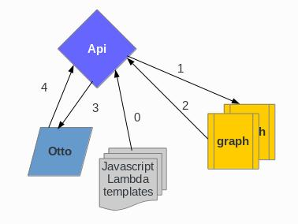

# LambdaQuery 可擴充運算聚合模組
* support open-falcon graph


### How it work
* Api 在啟動的時候會將LBJST (lambda javascript templates) 讀取成一個string map (0)
* Api 接收到外部請求後會依照外部請求的條件去拿取metric data (1,2)
* Api 在取回資料之後依照api請求的lambda function執行運算
  * 採用的是 otto 作為中介層.
  * 使用javascript中介層可以讓使用者更靈活的去定義要計算程序
  * [otto - JavaScript parser and interpreter written natively in Go](https://github.com/robertkrimen/otto)
* 資料和參數以及從(0)取回的javascript template code 會置入otto vm運算, 最後返回結果 (3,4)



### A sample RESTful API
* 將hostA & hostB的網路流量做加總
```
{
  "from":  1504240064,
  "until": 1504250000,
  "endpoints": [
    "hostA",
    "hostB"
  ],
  "metrics": [
    "net.if.in.bin/iface=eth_all"
  ],
  "func": {
    "function":  "sumAll",
    "aliasName": "combineAllData"
  }
}
```

* Curl example
```
#!/bin/bash

curl -s 'http://10.20.30.40:10080/api/v1/lambdaq/q' \
     -H 'Content-Type: application/json' \
     -H 'ApiToken: {"name":"example-user","sig":"example-sig-as-28c422f8a72011e79ecd0242ac120010"}' \
     -d '{"from": 1504240064, "until": 1504250000, "endpoints": ["hostA", "hostB"], "metrics": ["net.if.in.bits/iface=eth_all"], "func":{"function":"sumAll"}}'

```
