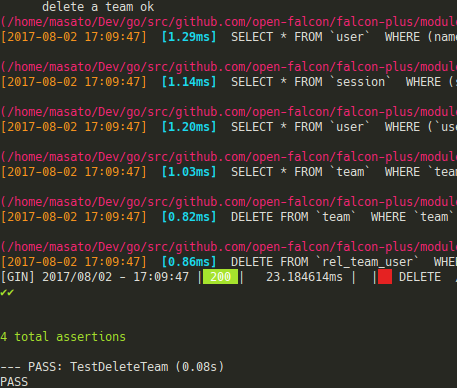

## api模組測試機制

此api測試使用的是 [goconvey](https://github.com/smartystreets/goconvey) 作為測試框架, 它可以相容於一般的`go test `機制

因為api測試比較特別, 有一些需要整合測試資料以及gin框架的middleware. 所以這裡的測試主要還是以api個別作整合測試為主軸.

#### 測試程序撰寫說明:

1. 可以參照 `./uic` 下面的測試範例實作, `run_test.sh`作為控制該scope下所有測試的進入點.
裡面每一個測試都可以個別執行. `[ "$1" == "create" ]` 作為判斷要不要跑創建的測試, 作為個別處理主要是因為建立為一次性測試, 除非將資料庫還原清空要不然第二次以後的測試都不會通過.

2. 為了方便撰寫測試, 在`api/test_utils` 裡面撰寫了一些輔助測試功能. 如果想要了解或是做個別客制可以到這個文件夾看看.

3. 測試使用的資料庫, 需要預先載入一些測試資料
  * 測試資料放置位置 `test_utils/sqltestset`
    * 如果需要增加新的測試資料請依照`t?_ooo.sql`去編號命名, 如果資料建立有先後順序關系, 請調整t之後的數字排序. 可以輔助判斷資料建立的順序
  * 資料庫的建立:
    * 方法一(推薦): 簡易的辦法是建立測試的docker-image. `cd ${open-falcon-backend_root_dir}/docker && docker-compose -f init.yml up -d mysqltest`
    * 方法二: 你可建立一個空的資料庫, 並手動執行過所有open-faclon需要資料的db patch. 然後運行 `cd test_utils/sqltestset && ./import_test_data.sh`
  * 需要註意的是預設測試使用的資料庫port 為 `3307`
4. 測試時會使用api模組資料夾下的`test_cfg`作為測試設置檔. 可以依需求修改此設置檔.
5. 如何執行測試
  * 帶有創建資料的測試
    * sh run_test.sh create
  * sh run_test.sh
  * 執行個別的測試案例
    * go test -v team_info_test.go -test.run TestTeamGetInfo

